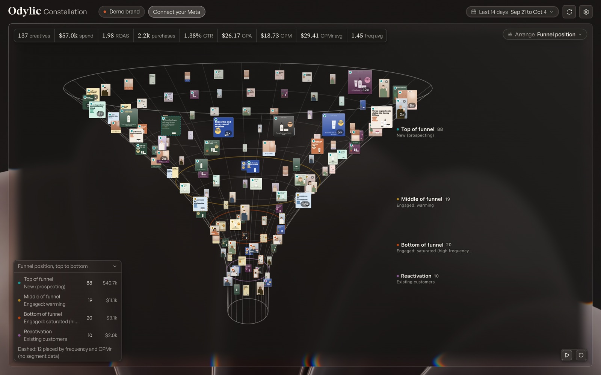

# Odylic Constellation

See every Meta ad you're running as a card in 3D space. By default, ads sit in a 3D funnel
by where Meta actually delivered them: new people, engaged people, or existing customers.
Regroup them by your naming convention, by format, campaign, ad set or spend cohort. Click any
card for its numbers and charts. Scroll toward any ad to zoom right onto it.

Free. Runs on your own Mac. Read-only: it never changes anything in your ad account.



## Install (macOS)

Paste this into Terminal:

```bash
curl -fsSL https://raw.githubusercontent.com/peterquads/odylic-constellation/main/install.sh | bash
```

Then open **Odylic Constellation** from your Applications folder or Spotlight. It opens in your
browser at http://127.0.0.1:8777 with a demo brand loaded, so you can look around before you connect
anything.

You need Git, Python 3.10 or newer and Node.js 20.19 or newer (or 22.12 or newer). If one is missing,
the installer says which and where to get it. Linux works too; run `~/odylic-constellation/start.sh` after installing.

## Connect your Meta ads

Click **Connect your Meta** and pick one of two ways in. Either way the app reads one ad account at a
time; switch accounts from the settings menu.

**1. The Meta Ads CLI** (easiest if you already use it)

Meta's official command line tool keeps its login in two settings, `ACCESS_TOKEN` and
`AD_ACCOUNT_ID`. If they're set in your environment or in a `.env` file in your home folder, the app
finds them, checks the token with Meta through its own rate governor, and connects. It never runs the
`meta` command itself, so every call it makes is counted. To set it up from scratch:

```bash
pip install meta-ads
```

Then put `ACCESS_TOKEN=...` and `AD_ACCOUNT_ID=act_...` in `~/.env`.

**2. An access token**

In Meta Business Settings, open System users, add one, assign it your ad account with view access,
and generate a token with the `ads_read` permission. Paste it into the app. The token is stored only
on your Mac, in `~/Library/Application Support/Odylic Constellation/config.json`, readable by your
user alone.

## What you can do

- **Funnel position**, the default view. Each ad's spend is split by Meta's own customer segments:
  prospecting (top of funnel), engaged (middle and bottom, split by how hard the account is
  hitting them), and existing customers (reactivation). Ads with no segment data are placed from
  frequency and cost per reach, drawn dashed so you know which is which.
- **Your naming convention.** The app reads your ad names and picks out the fields on its own:
  funnel stage, angle, persona, format, hook, creator, version and so on. Underscore, dash, pipe
  and `KEY:value` styles all work, mixed in one account too.
- **Creative type, status, campaign, ad set.**
- **Spend cohorts.** Top 20%, middle 50% and bottom 30% of ads by spend.
- **Metric space.** Put any three metrics on the X, Y and Z axes, or bin ads by one metric.
- **Zoom.** Scroll or pinch toward any card, or double-click it. The reset button brings the
  whole view back. Drag to turn the space.
- **Groups.** Click a group in the legend (or its label in the space) to fly to it; in the XYZ view a
  click spotlights the group. Right-click a group for Isolate in model (everything else darkens),
  Isolate into plain view (a sortable grid) or Isolate into slideshow (one ad at a time with its
  metrics; arrow keys, Space to play).
- **Variations.** Ads running the same visual stack into one card with an "N×" badge. In the ad
  view, arrows step through each ad on that visual and through each copy version with its results.
- **Ad detail.** Click a card for its creative, every metric (spend, ROAS, CPA, CPM, CPMr, frequency,
  CTR, hook and hold rate and more) and charts: spend and ROAS by day, customer segment, age by
  gender, placements and video retention.

## Built not to get your Meta app in trouble

Meta restricts apps that call its API too hard. Every call goes through a rate governor:

- Read-only. Anything that would change your account is refused before it leaves your Mac.
- At most 180 calls an hour (set `ODYLIC_META_MAX_PER_HOUR` to change it), with at least a second
  between calls.
- It backs off when Meta reports 50% usage, and pauses for 5 minutes, then 30 minutes, 2 hours and
  6 hours if Meta keeps throttling. It follows Meta's own wait time whenever Meta gives one.
- An account with up to about 150 ads in the date range loads in 3 to 5 calls. Bigger accounts take
  about one more call per 35 ads: about 9 for 300 ads, 28 for 1,000. Each date range is cached for 6
  hours, and ad names and creatives are reused across ranges, so changing the range on a 300 ad
  account usually costs 3 calls. Refresh within 2 minutes of a load costs nothing.
- While calls are paused you still see the last data you loaded. A load a pause interrupted keeps
  what it already fetched and finishes once the hourly budget has room for the rest.
- Charts in the ad drawer load one at a time, only for the card you stay on.

Your token and ad data only ever go between your Mac and Meta (`graph.facebook.com` for data, Meta's
image servers for thumbnails). The page also loads its two fonts from Google Fonts and Fontshare;
those requests carry no token, no ad data and no referrer.

The local server answers only pages served from this Mac at 127.0.0.1 or localhost. Requests that
other websites send to it are refused. Other user accounts on the same Mac can still open the page
while the app runs.

## Update or remove

Update by running the install command again. It stops the running app server, updates, and starts
the new version.

To remove it, first stop the server:

```bash
cd ~/odylic-constellation && .venv/bin/python -m api.healthcheck http://127.0.0.1:8777 --stop-ours
```

(It only stops a server it can prove is this app, never anything else on that port.)

Then delete `~/odylic-constellation`, `/Applications/Odylic Constellation.app` (or
`~/Applications/Odylic Constellation.app` on an account that can't write to Applications),
`~/Library/Application Support/Odylic Constellation` and `~/Library/Logs/Odylic Constellation`.

## Run it by hand

```bash
~/odylic-constellation/start.sh --open
```

---

Made by [Odylic Media](https://odylicmedia.com). Not affiliated with Meta. MIT license, provided
as is with no warranty.
